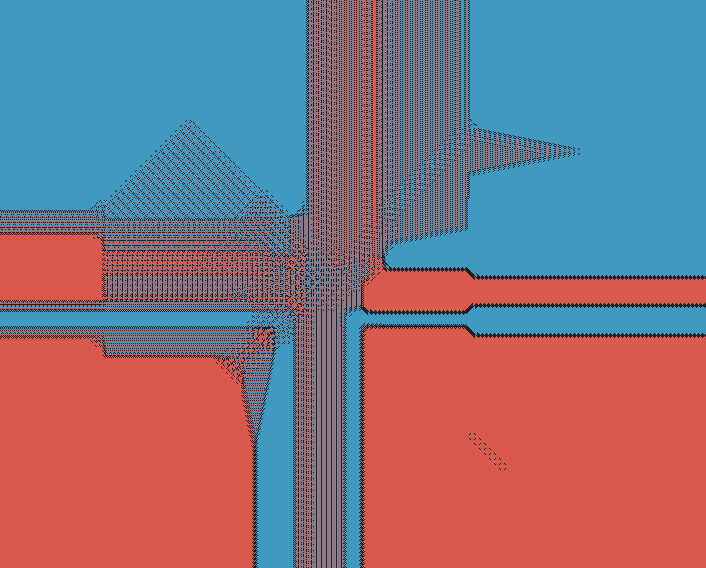
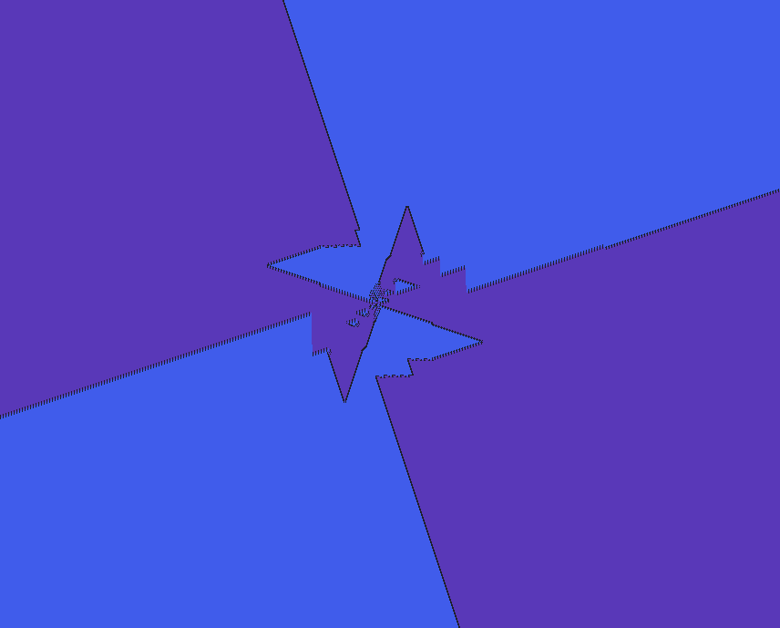

# This entire codebase was almost entirely written with various different LLMs

## Red & Black Knights

Interactive visual simulator: several colored **pieces** take turns **placing** tokens on an infinite board indexed by a **square spiral**. Each piece uses a chess-like **attack pattern** (knight, wazir, ferz, gnu, chimera, and others). Placements are blocked on occupied cells and on squares “attacked” by pieces you configure to respect. The result is turn-by-turn growth of intricate, often fractal-looking color patterns—not a capture-based chess game, but a constraint puzzle on spiral order.

The default preset is two knights (dark and red) that each avoid the other’s knight moves—the namesake **red & black knights** setup.

Built with [Bevy](https://bevyengine.org/) and [egui](https://github.com/emilk/egui). Runs natively and in the browser (WASM). **Play online:** [red_black_knights on itch.io](https://tcc.itch.io/red-black-knights) (hosted WASM build).

## How it works

1. **Spiral indexing** — Cell `0` is the center; indices increase along a counterclockwise square spiral (see `src/spiral.rs`, related to [OEIS A316667](https://oeis.org/A316667)).
2. **Turns** — Pieces act in round-robin order. On its turn, a piece scans forward from its cursor along the spiral for the first **empty** cell that is not **forbidden** for that piece.
3. **Placement** — The piece occupies that cell (shown in its color) and marks every cell its piece would attack from there.
4. **Blocking** — Each piece’s `blocked_by` list controls which other pieces’ attacks it must avoid (a per-cell attacker bitmask in board coordinates, masked per defender). In the classic two-knight preset, each knight only respects the other.

You can mix piece types, cliques (everyone blocks everyone), pairwise setups, random generators, and shareable game definitions from the UI.

## Examples + sharecodes

Here's some examples:


```
  rbk:1:eyJ2ZXJzaW9uIjoxLCJnYW1lIjp7InBpZWNlcyI6W3sibmFtZSI6ImtuaWdodF8wIiwiY29sb3IiOnsiciI6MC4xNSwiZyI6MC4xNSwiYiI6MC4yLCJhIjoxLjB9LCJ2YWxpZF9tb3ZlcyI6W1stMiwtMV0sWy0yLDFdLFstMSwtMl0sWy0xLDJdLFsxLC0yXSxbMSwyXSxbMiwtMV0sWzIsMV1dLCJibG9ja2VkX2J5IjpbMV0sImVuYWJsZWQiOnRydWV9LHsibmFtZSI6ImtuaWdodF8xIiwiY29sb3IiOnsiciI6MC44NSwiZyI6MC4xMiwiYiI6MC4xMiwiYSI6MS4wfSwidmFsaWRfbW92ZXMiOltbLTIsLTFdLFstMiwxXSxbLTEsLTJdLFstMSwyXSxbMSwtMl0sWzEsMl0sWzIsLTFdLFsyLDFdXSwiYmxvY2tlZF9ieSI6WzBdLCJlbmFibGVkIjp0cnVlfV0sInR1cm5fb3JkZXIiOlswLDFdfSwiY2FtZXJhIjp7IngiOjguMCwieSI6OC4wLCJ6b29tIjoxNi4yMTU4MjZ9LCJ0YXJnZXRfaW5kZXgiOjEzMDA2NTIsImJvYXJkX2NvbG91cl9tb2RlIjoiUGllY2UiLCJ2aXNpdF9vcmRlciI6InNxdWFyZV9zcGlyYWwifQ==
```



```
  rbk:1:eyJ2ZXJzaW9uIjoxLCJnYW1lIjp7ImFybWllcyI6W3sibmFtZSI6InplYnJhXzAiLCJjb2xvciI6eyJyIjowLjI1LCJnIjowLjYsImIiOjAuNzUsImEiOjEuMH0sInZhbGlkX21vdmVzIjpbWy0zLC0yXSxbLTMsMl0sWy0yLC0zXSxbLTIsM10sWzIsLTNdLFsyLDNdLFszLC0yXSxbMywyXV0sImJsb2NrZWRfYnkiOlsxXSwiZW5hYmxlZCI6dHJ1ZX0seyJuYW1lIjoiemVicmFfMSIsImNvbG9yIjp7InIiOjAuODUsImciOjAuMzUsImIiOjAuMywiYSI6MS4wfSwidmFsaWRfbW92ZXMiOltbLTMsLTJdLFstMywyXSxbLTIsLTNdLFstMiwzXSxbMiwtM10sWzIsM10sWzMsLTJdLFszLDJdXSwiYmxvY2tlZF9ieSI6WzBdLCJlbmFibGVkIjp0cnVlfV0sInR1cm5fb3JkZXIiOlswLDFdfSwiY2FtZXJhIjp7IngiOjU3OC41OTg3LCJ5IjotMTMuNDEyMDQ1LCJ6b29tIjoxMC4wMTkzNjV9LCJ0YXJnZXRfaW5kZXgiOjYwMTMxOCwiYm9hcmRfY29sb3VyX21vZGUiOiJBcm15In0=
```


```
  rbk:1:eyJ2ZXJzaW9uIjoxLCJnYW1lIjp7ImFybWllcyI6W3sibmFtZSI6ImtuaWdodF8wIiwiY29sb3IiOnsiciI6MC4xNSwiZyI6MC4xNSwiYiI6MC4yLCJhIjoxLjB9LCJ2YWxpZF9tb3ZlcyI6W1stMywwXSxbLTIsLTFdLFstMiwxXSxbLTEsLTJdLFstMSwyXSxbMCwtM10sWzAsM10sWzEsLTJdLFsxLDJdLFsyLC0xXSxbMiwxXSxbMywwXV0sImJsb2NrZWRfYnkiOlsxXSwiZW5hYmxlZCI6dHJ1ZX0seyJuYW1lIjoia25pZ2h0XzEiLCJjb2xvciI6eyJyIjowLjg1LCJnIjowLjEyLCJiIjowLjEyLCJhIjoxLjB9LCJ2YWxpZF9tb3ZlcyI6W1stMywwXSxbLTIsLTFdLFstMiwxXSxbLTEsLTJdLFstMSwyXSxbMCwtM10sWzAsM10sWzEsLTJdLFsxLDJdLFsyLC0xXSxbMiwxXSxbMywwXV0sImJsb2NrZWRfYnkiOlswXSwiZW5hYmxlZCI6dHJ1ZX1dLCJ0dXJuX29yZGVyIjpbMCwxXX0sImNhbWVyYSI6eyJ4Ijo0MDQuMTc4NDQsInkiOi0xMTEuNDYzNywiem9vbSI6MTIuMTQxMTA4NX0sInRhcmdldF9pbmRleCI6ODE2MjIwLCJib2FyZF9jb2xvdXJfbW9kZSI6IkFybXkifQ==
```


```
  rbk:1:eyJ2ZXJzaW9uIjoxLCJnYW1lIjp7ImFybWllcyI6W3sibmFtZSI6IlBpZWNlIDAiLCJjb2xvciI6eyJyIjowLjcwNzQ1MDg3LCJnIjowLjIzODU1OTU3LCJiIjowLjE2NDM2Mjg4LCJhIjoxLjB9LCJ2YWxpZF9tb3ZlcyI6W1stMiwwXSxbLTEsMF0sWzAsLTJdLFswLC0xXSxbMCwxXSxbMCwyXSxbMSwwXSxbMiwwXV0sImJsb2NrZWRfYnkiOlsxXSwiZW5hYmxlZCI6dHJ1ZX0seyJuYW1lIjoiUGllY2UgMSIsImNvbG9yIjp7InIiOjAuODY4MDY0OSwiZyI6MC44MTM2MjU0LCJiIjowLjI4MDQ4Njk0LCJhIjoxLjB9LCJ2YWxpZF9tb3ZlcyI6W1stMiwwXSxbLTEsMF0sWzAsLTJdLFswLC0xXSxbMCwxXSxbMCwyXSxbMSwwXSxbMiwwXV0sImJsb2NrZWRfYnkiOlswXSwiZW5hYmxlZCI6dHJ1ZX1dLCJ0dXJuX29yZGVyIjpbMSwwXX0sImNhbWVyYSI6eyJ4Ijo0MDMuNTIxODUsInkiOi05NjQuOTEyMSwiem9vbSI6MjQuNjYzNTc2fSwidGFyZ2V0X2luZGV4IjozMTY2Mzg5LCJib2FyZF9jb2xvdXJfbW9kZSI6IkFybXkifQ==
```



```
  rbk:1:eyJ2ZXJzaW9uIjoxLCJnYW1lIjp7ImFybWllcyI6W3sibmFtZSI6IlBpZWNlIDAiLCJjb2xvciI6eyJyIjowLjM1MDY4NjQsImciOjAuMjE4NjE3ODMsImIiOjAuNzIyOTUyMjUsImEiOjEuMH0sInZhbGlkX21vdmVzIjpbWy0xLC0yXSxbLTEsLTFdLFstMSwwXSxbLTEsMV0sWy0xLDJdLFsxLC0yXSxbMSwtMV0sWzEsMF0sWzEsMV0sWzEsMl1dLCJibG9ja2VkX2J5IjpbMV0sImVuYWJsZWQiOnRydWV9LHsibmFtZSI6IlBpZWNlIDEiLCJjb2xvciI6eyJyIjowLjI0OTExMzk5LCJnIjowLjM2MTU4NTg2LCJiIjowLjkyMzM1MjYsImEiOjEuMH0sInZhbGlkX21vdmVzIjpbWy0yLC0xXSxbLTIsMV0sWzIsLTFdLFsyLDFdXSwiYmxvY2tlZF9ieSI6WzBdLCJlbmFibGVkIjp0cnVlfV0sInR1cm5fb3JkZXIiOlswLDFdfSwiY2FtZXJhIjp7IngiOjI1NS40NDY1MywieSI6LTE3Ny42Miwiem9vbSI6MTIuMTYyM30sInRhcmdldF9pbmRleCI6Nzg0MDIzLCJib2FyZF9jb2xvdXJfbW9kZSI6IkFybXkifQ==
```

## Run locally (native)

This repo defines dev aliases in `.cargo/config.toml` that enable Bevy dynamic linking for faster iteration:

```bash
cargo rund --bin red_black_knights
```

Other useful commands:

```bash
cargo buildd          # cargo build --features bevy/dynamic_linking
cargo testd           # cargo test --features bevy/dynamic_linking
cargo rund --release --bin red_black_knights
```

Smoke test (exits after ~2 seconds):

```bash
cargo rund --bin red_black_knights -- --smoke-test
```

For shipping-style native release builds, use `cargo build --release` without the `buildd`/`rund` aliases.

## Run in the browser (WASM)

Hosted build: **[red_black_knights on itch.io](https://tcc.itch.io/red-black-knights)**.

To build and serve locally, requires `wasm-bindgen-cli` (`cargo install -f wasm-bindgen-cli`). The toolchain file already includes the `wasm32-unknown-unknown` target.

```bash
./web/serve.sh
```

Optional: `PROFILE=wasm-release ./web/serve.sh` for a smaller binary (`opt-level = s`).

## Other binaries

| Command | Purpose |
|--------|---------|
| `cargo run --release --bin time_sim` | Benchmark simulation throughput on fixed presets (see [`docs/OPTIMISATION.md`](docs/OPTIMISATION.md)). |
| `cargo run --release --bin discover_batch` | Batch-generate and render candidate setups (pattern discovery). |
| `cargo run --release --bin discover_reference` | Reference renders for discovery pipeline. |
| `cargo run --release --bin discover_rerender` | Re-render from saved discovery metadata. |
| `cargo run --release --bin perf_render` | Headless raster timing A/B. |
| `cargo run --release --features app_profile --bin perf_app` | Scripted in-app profiling scenarios. |

Place-level sim profiling uses the `place_profile` feature and `profile_place` binary.

## Project layout

| Path | Role |
|------|------|
| `src/sim.rs` | Turn loop, occupancy, coordinate `AttackGrid` / `MaskCells` |
| `src/sim_worker.rs` | Background sim on native; `SimDisplay` snapshots to the UI |
| `src/model.rs` | Pieces, piece move sets, presets |
| `src/spiral.rs` | Index ↔ coordinates on the square spiral |
| `src/index_order.rs` | Visit-order variants (default spiral; share/import) |
| `src/render.rs` | Grid-sized board texture and coloring |
| `src/ui.rs` | Sidebar, presets, run controls, share codes |
| `src/discover.rs` | Offline discovery runs and PNG export |
| `docs/SIMULATION.md` | How placement simulation and forbidden storage work |
| `docs/OPTIMISATION.md` | Performance guardrails, timings, experiments |
| `src/test-data/` | Share-code fixtures and golden board PNGs (see **Examples**) |

## Performance notes

Simulation hot paths are heavily tuned (dense spiral occupancy, coordinate forbidden grid with adaptive cell width, soft memory budget with fallible growth on WASM, background worker on native). Architecture is summarized in [docs/SIMULATION.md](docs/SIMULATION.md); methodology and benchmarks are in [docs/OPTIMISATION.md](docs/OPTIMISATION.md).
