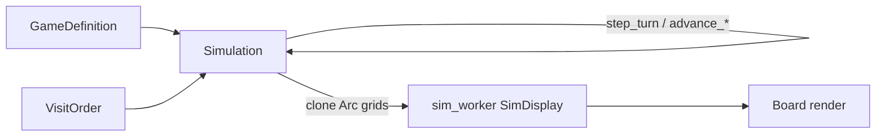

# How the simulation works (`src/sim.rs`)

This document describes the **placement simulation** that fills the board in red_black_knights: turn order, legal squares, forbidden (attacked) cells, and how state is stored for rendering and debugging. For performance history and benchmarks, see [OPTIMISATION.md](./OPTIMISATION.md). Worker threading and UI snapshots live in `src/sim_worker.rs`.

## What problem it solves

Each **piece** (army) takes turns in a fixed order. On its turn, it scans the board in a **monotonic visit order** (spiral index `0, 1, 2, …`) starting from where it left off last time. It places on the **first** spiral cell that is:

1. **Not occupied** by any piece, and  
2. **Not forbidden** — not under attack from attackers that piece **respects** (see `GameDefinition` / `blocked_by`).

When it places, it records occupancy, appends to placement history, and marks every cell its move pattern attacks as forbidden for defenders that respect this attacker.

The sim runs until every **enabled** piece’s cursor has moved past a **target spiral index** (driven by the viewport / zoom), or until a piece cannot place (cursor wraps), or until **memory saturation** stops growth safely (especially on WASM).

There is no chess-style “capture” or movement of existing stones: placements are **append-only**; occupied cells are skipped forever.

## Inputs

| Input | Role |
| --- | --- |
| [`GameDefinition`](src/model.rs) | Piece move sets (`valid_moves`), which attackers each piece respects (`blocked_by`), enabled flags, and `turn_order`. |
| [`VisitOrder`](src/index_order.rs) | Maps spiral index ↔ board `(x, y)` and defines how to step `(cursor, xy)` when scanning. Must match rendering and share codes. Default: CCW square spiral. |

At construction, the sim derives:

- **`respected_mask[defender]`** — bitmask of attacker ids whose threats block that defender (`blocked_by`).
- **`move_radius[piece]`** — max Chebyshev radius of its moves (for attack-grid growth).
- **`active_turn_order`** — enabled pieces in turn order (copy of definition’s active order).

## Core state: `Simulation`

`Simulation` is a Bevy [`Resource`](https://docs.rs/bevy/latest/bevy/ecs/system/struct.Resource.html) (also `FromWorld` using the world’s `GameDefinition`).

Public fields used elsewhere include `visit_order`, `occupancy`, `cursors`, `turn_step`, and `placements`. Internal fields power the hot path:

- **`attack_grid`** — cumulative “who attacks this `(x,y)`” bitmasks in **board coordinates** (not spiral index).
- **`cursor_positions`** — cached `(x,y)` for each piece’s cursor (avoids recomputing from index every scan step).
- **`turn_order_index`** — rolling index into `active_turn_order` (no modulo in the inner loop).
- **`piece_tally`** — cheap per-piece stats (placement count, first/last spiral index) for the debug UI.
- **`saturated` / `mem_budget_bytes`** — soft stop when footprint exceeds budget or allocation fails.

### Per-piece cursor

Each piece has:

- **`cursors[piece_id]`** — next spiral index to examine on that piece’s turn.
- **`cursor_positions[piece_id]`** — board coordinates of that index.

Cursors only move forward (monotonic in index space). After a successful placement, the cursor is bumped **past** the cell just filled so the next scan does not re-check an occupied self-placement.

If a full scan reaches index wrap (`cursor + 1 == 0`), the turn ends with **no placement** and cursors are left at the failure point.

## Turn loop

```
advance_to_target / advance_for_duration
        │
        └── while needs_work(target_index)
                └── step_turn
                        └── step_turn_scan
```

### `step_turn_scan` (one piece, one turn)

1. Pick `piece_id` from `active_turn_order[turn_order_index]`, advance turn index, increment `turn_step`.
2. Loop from local `(cursor, xy)`:
   - **Occupied?** `occupancy.contains_index(cursor)`
   - **Forbidden?** `(attack_grid.at(x, y) & respected_mask[piece_id]) != 0`
   - If both false → **`place`** at `(cursor, xy, piece_id)`; on success, advance cursor and return `true`.
   - Else advance `cursor` and `xy` via `visit_order.scan_step_xy` until wrap or success.
3. On placement allocation failure, cursor is **not** advanced; returns `false` and sets **`saturated`**.

`step_turn` is the public wrapper; profiling builds use `step_turn_scan::<true>` to count examined cells.

### `place`

Three fallible updates (any failure → `saturated`, no panic on OOM):

1. **`occupancy.insert(index, piece_id)`** — dense vector indexed by spiral index; empty slots use sentinel `EMPTY_ARMY_SLOT`.
2. **`record_forbidden`** — OR attacker bit `1 << piece_id` into every cell reached by `valid_moves` from `(x,y)` on `attack_grid`.
3. **`placements.push(index, piece_id)`** — append-only log `(spiral_index, piece_id)`.

Then **`note_placement_tally`** updates debug aggregates.

### When to keep simulating: `needs_work`

Returns true if **any enabled** piece still has `cursor <= target_index`. The UI/worker sets `target_index` from visible spiral range so the board fills out to what you can see at the current zoom.

### Advance modes

- **`advance_to_target`** — run turns until `needs_work` is false or `step_turn` fails or memory check trips (every 4096 turns).
- **`advance_for_duration`** — same loop but also stops after a wall-clock budget (batched time check every 4096 turns). Calls `ensure_unique_for_mutation` on occupancy/placements first so worker mutation does not fight UI `Arc` snapshots.

## Two grids, two coordinate spaces

The design deliberately splits **occupancy** and **forbidden** representation:

| Structure | Index space | Purpose |
| --- | --- | --- |
| **`OccupancyGrid`** | Spiral **index** (dense `Vec`) | O(1) “is this spiral cell taken?” in the scan loop; no hashing. |
| **`AttackGrid`** | Board **(x, y)** square centered on origin | Cumulative attacker bitmasks; scan tests one masked read per cell (see below). |

**Respected threats** come from `blocked_by`: if piece B lists A in `blocked_by`, B’s `respected_mask` includes A’s bit, so cells attacked by A are forbidden for B’s scan.

---

## Attack grid and `MaskCells` (forbidden storage)

This is the most intricate part of `sim.rs`. It replaced an older design (per-attacker spiral bitsets, `ForbiddenSet` words, and forbidden **word-tail skips** in the scan loop) with a single 2D grid in board coordinates. The migration and follow-ups are documented at the end of [OPTIMISATION.md](./OPTIMISATION.md) (“coordinate forbidden grid”, “adaptive cell width”, “OOM-safe advance”).

### Problem the old design had

On each placement, `record_forbidden` used to call `visit_order.xy_to_index` **once per move offset** to mark attacked spiral cells in layered bitsets. Profiling showed that indexing dominated place time (often 60–72% of a place replay). The scan loop already walked `(x, y)` incrementally and only needed “is this coordinate attacked by someone I respect?” — it did not need spiral indices for forbidden checks.

The coord-grid approach stores **one combined attacker bitmask per board cell** and marks with `row * stride + col` only. That removes `xy_to_index` from the simulation hot path entirely (it remains in UI, debug helpers, and `placement_attacks_index`).

### What `AttackGrid` stores

`AttackGrid` is a square, axis-aligned buffer covering coordinates `[-half, half]` on both axes (Chebyshev “radius” `half`, not the same as spiral index).

- **`stride`** = `2 * half + 1` (side length of the square).
- **Index** for cell `(x, y)` inside bounds:  
  `i = (y + half) as usize * stride + (x + half) as usize`
- **Value** at `i`: a bitmask of attacker piece ids that have ever attacked this cell. Bit `k` means piece `k`’s move pattern hit `(x, y)` on some past placement.

Operations:

| Method | When | What it does |
| --- | --- | --- |
| **`at(x, y)`** | Every scanned cell in `step_turn_scan` | Returns `0` out of bounds; else loads cell mask as `u32` (widening `u8`/`u16` if needed). Scan uses `at(x,y) & respected_mask[defender] != 0`. |
| **`record(px, py, bit, max_radius, moves)`** | Each successful `place` | Ensures grid covers placement + moves (`reach = \|px\|.max(\|py\|) + max_radius`), then ORs `bit` (`1 << piece_id`) into every `(px+dx, py+dy)` from `valid_moves`. **No** `xy_to_index` in the move loop. |
| **`try_grow_to(need)`** | Before marking when `reach > half` | Doubles extent (amortized): new `half = max(old_half*2, need+1)`, reallocates via `try_regrow_cells`, copies old square into center of new square. Returns `false` on allocation failure (WASM OOM). |
| **`clear()`** | `Simulation::reset` when cell width unchanged | Zeroes all cells; keeps `half` and allocation. |

Initial size is small (`half = 8`); growth is **cold** (`#[cold]`) and rare after the board fills the needed region.

### Why board `(x, y)` instead of spiral index for forbidden?

- **Marking:** A piece’s moves are defined as offsets in board space. Writing into a coord grid is O(moves) plain stores.
- **Scanning:** The loop already holds `(x, y)` and steps with `visit_order.scan_step_xy`. Forbidden is one grid read at the current coordinate.
- **Semantics:** For defender `d`, legality uses only attackers in `blocked_by`. That is exactly `cell_mask & respected_mask[d]`, not “OR all per-attacker layers then test”.

Tradeoff accepted in production (see OPTIMISATION): memory is **O((2R)²)** for the attack square, with a larger constant than spiral-index bitsets, but still bounded by occupancy growth at extreme zoom. Scan no longer does forbidden **word-tail jumps** (skipping whole `u64` words of spiral indices), so worst-case cells examined per turn can rise (e.g. long forbidden runs are stepped one index at a time). Each step is cheaper (masked grid read vs layer/word logic), and aggregate `time_sim` dropped sharply after the migration.

### `respected_mask` vs what gets written

At sim build:

```text
respected_mask[defender] = OR over attackers in def.piece(defender).blocked_by of (1 << attacker)
```

- **Write path:** Every placement ORs `1 << piece_id` into attacked cells, regardless of who respects whom.
- **Read path:** Defender `d` only cares about bits in `respected_mask[d]`.

Attackers that **no** defender respects can still set high bits in the stored cell; those bits are irrelevant to every scan. That matters for **narrow** cell storage (below).

### `CellWidth` and `MaskCells` (adaptive cell width)

After the coord grid shipped, extreme zoom still implied a very large grid (~268 MB if every cell were `u32` at max extent). Most presets only need a handful of **respected** attacker bits: the union of all `respected_mask` values in a typical roster fits in ≤ 8 bits.

**`cell_width_for(respected_mask)`** picks the smallest integer type that can hold that union:

| Union of respected bits | Storage per cell |
| --- | --- |
| `< 256` (bits 0–7) | `u8` |
| `< 65536` | `u16` |
| else | `u32` |

**`MaskCells`** is an enum wrapping `Vec<u8>`, `Vec<u16>`, or `Vec<u32>` with the same row-major layout. The variant is chosen once in `Simulation::new` / `reset` and never changes for that sim instance.

Why an enum instead of always `Vec<u32>`?

1. **Memory:** Built-in presets use `u8` → **4×** smaller attack grid than `u32` at the same `half` (~67 MB vs ~268 MB at the documented max-zoom case in OPTIMISATION).
2. **CPU:** Denser cells improve cache behavior; A/B showed modest speedups at high turn counts, checksum-identical.
3. **Hot path:** `at` and `record` `match` on `MaskCells` **once per call**. `record` hoists the match **outside** the per-move loop so each attacked cell is a branch-free `|=` in the inner loop.

**Correctness when narrowing:** If piece id ≥ 8 (or ≥ 16), `1 << id` does not fit in `u8`/`u16`. On `record`, the attacker bit is cast/truncated when storing (`bit as u8`, etc.). Defenders who **respect** that attacker always include that bit in their `respected_mask`, so the union width is chosen to fit **all respected ids** — not every possible roster bit. Attackers nobody respects may lose high bits on store; scans never read those bits. Tests `narrow_cells_ignore_out_of_width_attacker_bits` and `cell_width_matches_highest_respected_bit` lock this.

`at` always returns `u32` so scan code uses one mask width for `& respected_mask`.

### `try_regrow_cells` (grow without losing marks)

When `half` increases, the grid must expand symmetrically around the origin. `try_regrow_cells` allocates a new `stride × stride` buffer (fallible `try_reserve_exact`), zero-fills it, then copies the old square into the correct offset in the new square so existing `(x,y)` indices still map to the same world coordinates. Old data is discarded after copy; attacker bits are preserved.

Piece cap **`MAX_PIECES = 32`** exists because masks are `u32` at the widest setting (one bit per piece id).

### Relationship to memory budget / saturation

`Simulation::footprint_bytes()` includes `attack_grid.byte_capacity()` (actual `Vec` capacity × bytes per cell). Together with occupancy and placements, this feeds the soft **`MEM_BUDGET_BYTES`** latch; `AttackGrid::record` / `try_grow_to` are the hard backstop if growth fails mid-placement. See [OPTIMISATION.md — OOM-safe advance](./OPTIMISATION.md) and the “Memory budget” section below.

### Quick reference: forbidden check in the scan loop

```text
forbidden_here = (attack_grid.at(xy.0, xy.1) & respected_mask[piece_id]) != 0
```

Occupancy still uses **spiral `cursor`**; forbidden uses **board `xy`** carried alongside the cursor. Both must stay in sync via `scan_step_xy` when the cursor advances.

### Further reading

| Topic | Where |
| --- | --- |
| Investigation harness (spiral bitset vs coord grid) | `src/bin/explore_coord_forbidden.rs`, OPTIMISATION § “2D coordinate forbidden grid” |
| Production migration + tradeoffs | OPTIMISATION § “Kept (2026-05-28 — coordinate forbidden grid in production)” |
| Adaptive `u8`/`u16`/`u32` cells | OPTIMISATION § “Kept (2026-05-28 — adaptive AttackGrid cell width)” |
| Fallible growth + budget | OPTIMISATION § “Kept (2026-05-28 — OOM-safe advance: memory budget + fallible growth)” |
| Implementation | `AttackGrid`, `MaskCells`, `CellWidth`, `try_regrow_cells` in `src/sim.rs` |

## Placement history: `PlacementsLog`

Append-only `Arc<Vec<(u32, PieceId)>>`. The UI can hold a cheap clone of the `Arc` while the worker mutates; before mutation, `ensure_unique_for_mutation` copies if `strong_count > 1`. Used for hover paths and debug (“which placement of attacker X blocked this cell?”).

Helpers:

- **`placement_attacks_index`** — whether a given placement attacks a spiral index (replay move set through `VisitOrder`).
- **`placement_blocking_attacker`** — walk placements backward to find the latest attacker placement that hits a target index.
- **`respected_forbidden_attackers`** — decode attack grid at an index for a scanning piece.

## Memory budget and saturation

**Footprint** ≈ capacities of occupancy vector, placements vector, and attack grid backing store.

- **Soft budget** (`MEM_BUDGET_BYTES`: 1 GiB WASM, 12 GiB native): checked every 4096 turns in advance loops; sets `saturated` without checking every placement.
- **Hard backstop**: fallible `try_reserve` / `try_grow_to` on growth; failed `place` also sets `saturated`.

While saturated, advances no-op; the renderer shows whatever region was filled. **`reset`** clears occupancy, attack grid, placements, cursors, and saturation (preserves or rebuilds attack grid width if `respected_mask` union changed).

## Introspection (debug / UI)

Without advancing the sim:

- **`upcoming_piece_id`**, **`scan_skips_on_next_scan`** — classify skipped cells on the next scan as occupied vs forbidden.
- **`forbidden_skips_on_next_scan`**, **`respected_forbidden_attackers`**, **`placement_blocking_attacker`** — explain why a cell is illegal.

`ScanSkips` and `PieceTally` feed the debug stats panel; tallies are maintained in `place`, not by replaying the scan loop.

## Integration sketch



On native, `SimulationBridge` runs `Simulation` on a background thread and pushes `SimDisplay` snapshots. On WASM, the same `Simulation` API runs on the main thread with time-budgeted `advance_for_duration`.

## Mental model vs classic rules

- **Turn-based**, not simultaneous: one placement attempt per turn step, one piece per step.
- **First-fit scan** in visit order, not global optimization or combat resolution.
- **Threats are cumulative** on the attack grid; only **respected** attackers affect a given piece’s legality.
- **Monotonic indices** assume visit order never revisits lower indices when stepping forward; alternative `VisitOrder` variants change *which* `(x,y)` each index means, not the algorithm shape.

## Related files

| File | Responsibility |
| --- | --- |
| `src/sim.rs` | `Simulation`, grids, turn/advance logic |
| `src/sim_worker.rs` | Threading, `SimDisplay`, frame budgets |
| `src/index_order.rs` | Index ↔ xy, scan stepping |
| `src/spiral.rs` | Default CCW square spiral geometry |
| `src/model.rs` | Pieces, `blocked_by`, turn order |
| `src/sim_piece_stats.rs` | UI stats derived from sim state |

Unit tests at the bottom of `sim.rs` cover occupancy, attack recording, turn order, saturation, and placement blocking; run with the project’s usual `cargo test` workflow.
